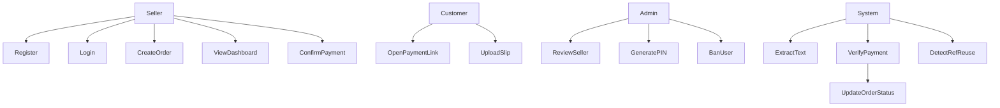
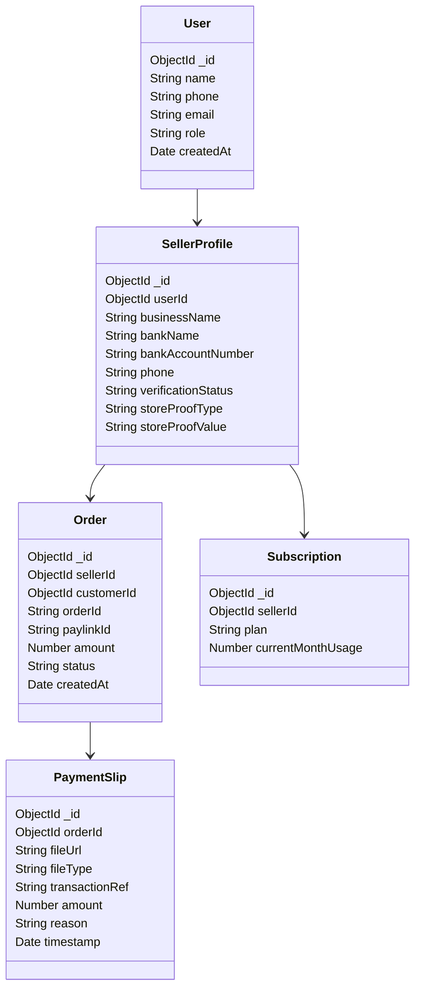

Below is the **complete regenerated System Architecture & Analysis Document for PayLink MVP**, integrating **all decisions made so far**. Nothing is omitted.

This version includes:

* Admin system
* Seller verification via PIN
* Cloudflare R2 storage
* JS-based OCR extraction
* Updated verification engine
* Timestamp validation
* Reference reuse detection
* SMS verification
* Subscription payment wall
* Seller dashboard analytics
* MongoDB schemas
* Use case diagrams
* Class diagrams
* API endpoints
* Plan enforcement logic
* Development assets

---

# PayLink – Complete System Architecture & Analysis (MVP)

## System Purpose

PayLink is a **payment verification platform for social-media sellers** (WhatsApp / Instagram businesses) that prevents **fake bank slip scams**.

It ensures that every payment is linked to a unique **PayLink ID**, verified through:

* slip text extraction
* SMS verification
* timestamp validation
* reference number reuse detection

---

# 1. Actors

| Actor                  | Description                                                |
| ---------------------- | ---------------------------------------------------------- |
| Seller                 | Business owner using PayLink to create and verify orders   |
| Customer               | Buyer who makes the bank transfer and uploads payment slip |
| Admin                  | Platform administrator managing users and preventing abuse |
| PayLink Backend        | Core API and verification system                           |
| SMS System             | Bank notification SMS received on seller device            |
| Fraud Detection Engine | Detects reference reuse and suspicious activity            |

---

# 2. Core Architecture

System components:

```
Seller Mobile App
        |
Customer Upload Page
        |
Backend API (Node.js + Hono.js)
        |
MongoDB Database
        |
Cloudflare R2 Storage
        |
OCR Text Extraction Layer
        |
Payment Verification Engine
```

---

# 3. Authentication System

Authentication will use **Better Auth**.

Features:

* seller registration
* login
* session handling
* password reset
* phone/email verification

---

# 4. Seller Verification System

To prevent abuse, sellers must be verified.

### Flow

1. Seller registers
2. Account status:

```
PENDING_VERIFICATION
```

3. Seller UI shows:

```
Please enter your verification PIN
```

4. Admin reviews seller profile

5. Admin generates verification PIN

6. PIN sent via SMS

7. Seller enters PIN

8. Account becomes:

```
ACTIVE
```

---

# 5. Seller Profile

Seller profile fields:

* business name
* logo
* bank name
* bank account number
* phone
* SMS template
* store proof evidence

---

# 6. Seller Business Proof

Seller must provide **business evidence**.

UI dropdown:

| Option           | Validation |
| ---------------- | ---------- |
| Physical Address | Text       |
| Instagram Store  | URL        |
| WhatsApp Store   | URL        |

Fields:

```
storeProofType
storeProofValue
```

Example:

```
INSTAGRAM
https://instagram.com/myshop
```

---

# 7. Customer Database

Customers automatically saved.

Features:

* search by phone
* auto-fill customer name
* view order history
* fraud warnings

---

# 8. Order Creation

Seller creates order.

Required:

* customer phone
* amount

Optional:

* customer name

System generates:

```
Order ID
PayLink ID
Payment Link
```

Example:

```
ORD-48291
PL-NIM-8K32
paylink.app.lk/ORD-48291
```

---

# 9. Payment Slip Upload

Customer opens payment page and uploads:

* PDF slip
* image slip

Slip stored in:

**Cloudflare R2**

Example path:

```
paylink-slips/sellerId/orderId/slip.jpg
```

---

# 10. Slip Storage

Storage provider:

Cloudflare R2 Object Storage

Advantages:

* cheap
* S3 compatible
* no egress costs
* scalable

Stored metadata:

```
fileUrl
fileType
uploadedAt
```

---

# 11. Text Extraction Layer

Instead of cloud OCR, use **JavaScript libraries**.

PDF extraction:

```
pdf-parse
pdfjs-dist
```

Image extraction:

```
tesseract.js
```

Extracted fields:

```
amount
transactionRef
reason
date
time
timestamp
bank
```

---

# 12. Timestamp Validation

Timestamp ensures slip is not reused.

Rule:

```
slip.timestamp > order.createdAt
```

This prevents **older slips reused for new orders**.

There is **no payment time restriction**.

---

# 13. Transaction Reference Reuse Detection

Sri Lankan banks do **not send transaction reference numbers via SMS**.

However slips contain them.

Therefore:

```
transactionRef extracted
```

System checks:

```
if transactionRef exists in DB
```

Result:

```
SUSPICIOUS_REF_REUSE
```

---

# 14. SMS Verification

Seller mobile app reads bank SMS.

Example:

```
Rs 7500 credited
Reason: PL-NIM-8K32
Time: 14:32
```

Verification:

```
sms.amount == order.amount
sms.reason contains PayLinkID
```

---

# 15. Payment Verification Layers

| Layer | Check                        |
| ----- | ---------------------------- |
| 1     | PayLink ID present in reason |
| 2     | Amount match                 |
| 3     | Timestamp validation         |
| 4     | Transaction reference reuse  |
| 5     | SMS verification             |

---

# 16. Order Status Lifecycle

```
PENDING_PAYMENT
SLIP_UPLOADED
SMS_VERIFIED
PAYMENT_CONFIRMED
MANUAL_REVIEW
REJECTED
```

---

# 17. Payment Verification Algorithm

Pseudo code:

```
function verifyPayment(order, slip, sms):

if slip.amount != order.amount
   return FAILED_AMOUNT_MISMATCH

if slip.transactionRef exists in database
   return SUSPICIOUS_REF_REUSE

if slip.timestamp <= order.createdAt
   return SUSPICIOUS_TIMESTAMP

if slip.reason does not contain order.paylinkId
   return MANUAL_REVIEW_PAYLINK_ID_NOT_FOUND

if sms.amount == order.amount
 and sms.reason contains order.paylinkId
   return VERIFIED

else
   return MANUAL_REVIEW_SMS_NOT_MATCHED
```

---

# 18. Subscription System (Payment Wall)

Plans:

| Plan  | Orders      |
| ----- | ----------- |
| Free  | 20 / month  |
| Basic | 500 / month |
| Pro   | Unlimited   |

Purpose:

Free plan encourages upgrade.

---

# 19. Plan Features

| Feature         | Free  | Basic | Pro       |
| --------------- | ----- | ----- | --------- |
| Orders          | 20    | 500   | Unlimited |
| Fraud Detection | Basic | Full  | Advanced  |
| Analytics       | ❌     | Basic | Full      |
| Support         | ❌     | Email | Priority  |

---

# 20. Subscription Schema

```
{
 _id: ObjectId,
 sellerId: ObjectId,
 plan: "FREE" | "BASIC" | "PRO",
 status: "ACTIVE" | "EXPIRED",
 monthlyOrderLimit: Number,
 currentMonthUsage: Number,
 billingStartDate: Date,
 billingEndDate: Date,
 createdAt: Date
}
```

---

# 21. Order Creation Limit Enforcement

Middleware:

```
if plan == FREE and usage >= 20
   throw PLAN_LIMIT_REACHED

if plan == BASIC and usage >= 500
   throw PLAN_LIMIT_REACHED
```

---

# 22. Usage Reset

Cron job monthly:

```
0 0 1 * *
```

Reset:

```
currentMonthUsage = 0
```

---

# 23. Seller Dashboard

Seller dashboard displays analytics.

Widgets:

### Orders Overview

```
Orders Created
Orders Verified
Pending Orders
Rejected Orders
```

---

### Revenue Overview

```
Total Amount Received
Today's Payments
Monthly Payments
```

---

### Activity Analytics

Charts:

* orders per day
* payments verified
* revenue trend

---

### Fraud Insights

Shows:

```
duplicate transaction references
manual reviews
rejected slips
```

---

### Usage Statistics

Displays:

```
Current Plan
Orders Used
Orders Remaining
Next Billing Date
```

Example:

```
Basic Plan
120 / 500 Orders Used
380 Remaining
```

---

# 24. Admin Dashboard

Admin controls:

User management

```
view sellers
disable user
ban user
```

Seller verification

```
generate PIN
approve seller
```

Fraud monitoring

```
view suspicious slips
reference reuse
```

Analytics

```
total sellers
orders processed
fraud reports
```

---

# 25. Use Case Diagram



---

# 26. Class Diagram



---

# 27. MongoDB Schemas

### Users

```
{
 _id: ObjectId,
 name: String,
 phone: String,
 email: String,
 passwordHash: String,
 role: "seller" | "admin",
 createdAt: Date
}
```

---

### SellerProfiles

```
{
 _id: ObjectId,
 userId: ObjectId,
 businessName: String,
 logoUrl: String,
 bankName: String,
 bankAccountNumber: String,
 phone: String,

 verificationStatus: "PENDING" | "ACTIVE" | "DISABLED" | "BANNED",

 storeProofType: "PHYSICAL_ADDRESS" | "INSTAGRAM" | "WHATSAPP",
 storeProofValue: String,

 createdAt: Date
}
```

---

### Orders

```
{
 _id: ObjectId,
 sellerId: ObjectId,
 customerId: ObjectId,
 orderId: String,
 paylinkId: String,
 amount: Number,
 status: String,
 createdAt: Date
}
```

---

### PaymentSlips

```
{
 _id: ObjectId,
 orderId: ObjectId,
 fileUrl: String,
 fileType: "pdf" | "image",
 transactionRef: String,
 amount: Number,
 reason: String,
 timestamp: Date,
 uploadedAt: Date
}
```

---

### SMSLogs

```
{
 _id: ObjectId,
 sellerId: ObjectId,
 smsContent: String,
 amount: Number,
 reason: String,
 receivedAt: Date
}
```

---

### VerificationPins

```
{
 _id: ObjectId,
 sellerId: ObjectId,
 pinCode: String,
 expiresAt: Date,
 used: Boolean,
 createdByAdminId: ObjectId,
 createdAt: Date
}
```

---

# 28. Development Assets

### PayLink ID

```
PL-{FIRST3NAME}-{RANDOM4}
```

Example

```
PL-NIM-8K32
```

---

### Order ID

```
ORD-{5digit}
```

Example

```
ORD-48291
```

---

### SMS Regex

Amount:

```
Rs\s?(\d+,?\d*)
```

Reason:

```
PL-[A-Z]{3}-[A-Z0-9]{4}
```

---

# Final Architecture Characteristics

The PayLink MVP is designed to be:

```
Fraud Resistant
Low Cost
Scalable
Admin Controlled
Subscription Ready
Solo Developer Friendly
```

---

If you'd like, the **next thing we should design is extremely important but currently missing**:

### Database Index Strategy

Without proper indexes, once you hit **100k+ orders**, MongoDB queries for:

* transactionRef detection
* order lookups
* analytics

will become **very slow**.
