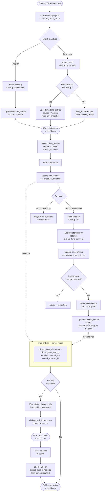

```mermaid
flowchart TD
    A([Connect ClickUp API key]) --> B[Sync tasks & projects\nto clickup_tasks_cache]
    B --> C{Check plan type}

    C -->|Pro plan| D[Fetch existing\nClickUp time entries]
    C -->|Free plan| E[Attempt read\nof existing records]

    D --> F[Upsert into time_entries\nsource = 'clickup']
    E --> G{Records exist\nin ClickUp?}
    G -->|Yes| H[Upsert into time_entries\nsource = 'clickup'\nread-only snapshot]
    G -->|No| I[time_entries empty\nnative tracking ready]

    F --> J
    H --> J
    I --> J

    J([User starts timer\nin dashboard]) --> K[Save to time_entries\nsource = 'native'\nstarted_at = now]
    K --> L[User stops timer] --> M[Update time_entries\nset ended_at, duration]
    M --> N{Pro plan?}

    N -->|Yes — bidirectional| O[Push entry to\nClickUp API]
    N -->|No — local only| P[Stays in time_entries\nno write-back]

    O --> Q[ClickUp stores entry\nreturns clickup_time_entry_id]
    Q --> R[Update time_entries\nset clickup_time_entry_id]
    R --> S{ClickUp-side\nchange detected?}
    S -->|Yes| T[Pull updated entry\nfrom ClickUp API]
    T --> U[Upsert into time_entries\nwhere clickup_time_entry_id matches]
    S -->|No| V[In sync — no action]

    subgraph PERSIST ["time_entries — never wiped"]
        TE["clickup_task_id · source · clickup_time_entry_id\nduration · started_at · ended_at · user_id"]
    end

    M -.->|writes to| PERSIST
    U -.->|upserts into| PERSIST

    PERSIST --> W{API key\nswitched?}
    W -->|Yes| X[Wipe clickup_tasks_cache\ntime_entries untouched]
    X --> Y[clickup_task_id becomes\norphan reference]
    Y --> Z([User reconnects\nClickUp key])
    Z --> ZA[Tasks re-sync\nto cache]
    ZA --> ZB[LEFT JOIN on\nclickup_task_id restores\ntask name & context]
    ZB --> ZC([Full history visible\nin dashboard])
    W -->|No| ZC
```

