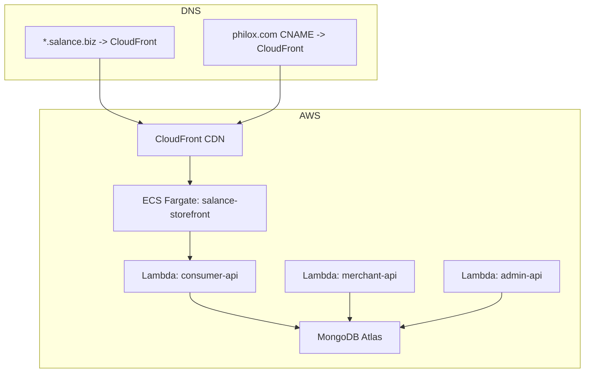
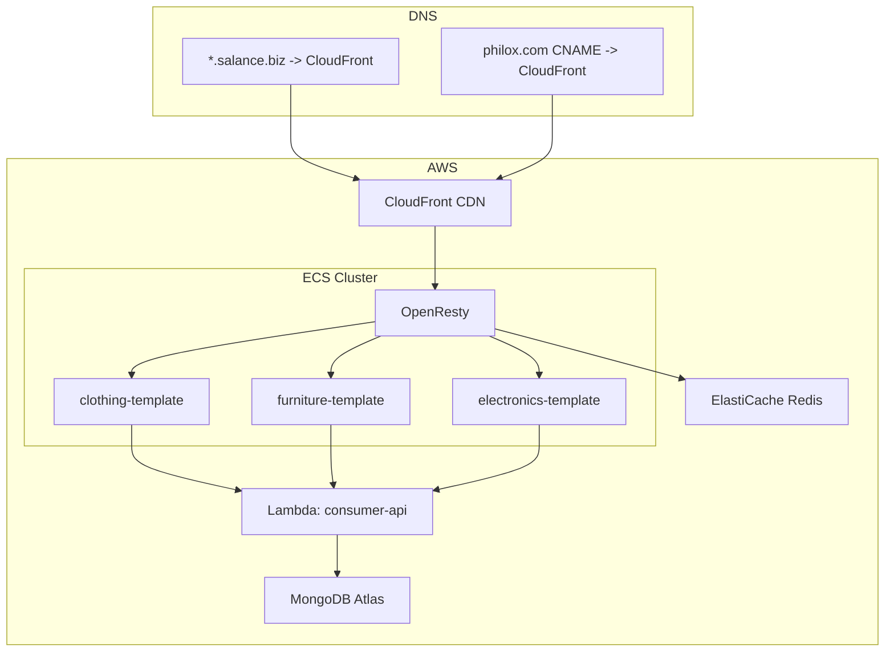
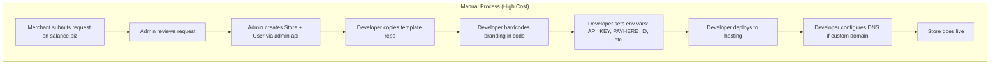
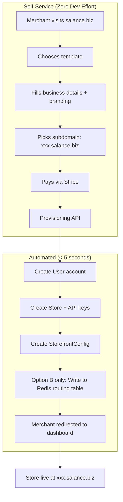
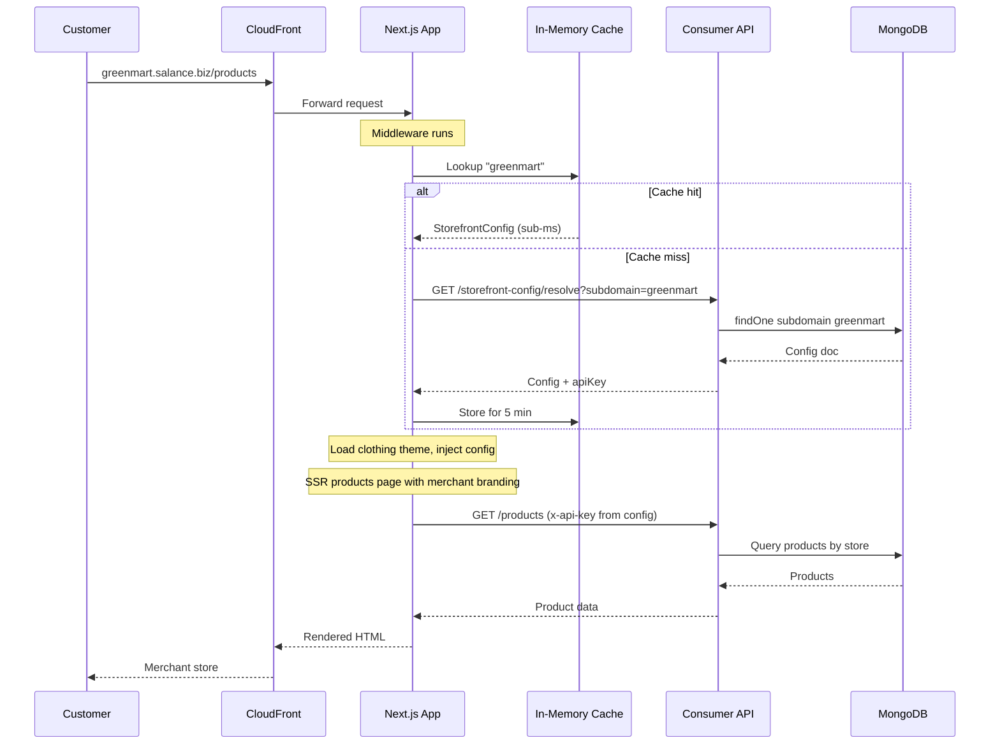
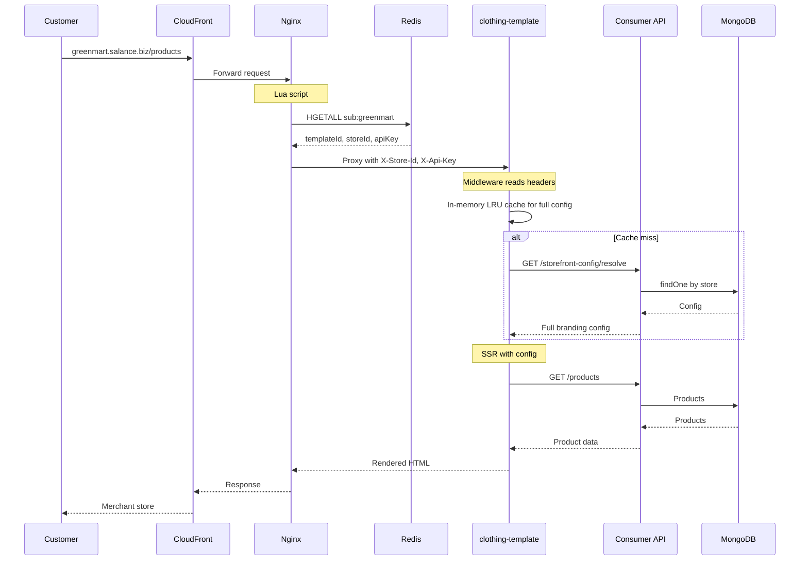

# Salance: Architecture Pivot -- Brief

Every new merchant currently requires a developer to copy a Next.js template, hardcode branding, configure env vars, and deploy. This manual process makes each merchant cost more than they pay. Both options below eliminate developer effort per merchant: merchants sign up, pick a template, fill their details, pay — and their store is live in seconds. No code changes, no deployments.

---

## MongoDB: New StorefrontConfig Collection

A new collection `storefront_configs` will be added. One document per store. All values currently hardcoded in template repos (store name, logo, colors, hero text, social links, etc.) will be stored here. The storefront app will read from this collection at runtime instead of env vars and build-time config.

**Fields we need:**

- **Routing**: `store` (ref to stores), `subdomain` (e.g. "greenmart" → greenmart.salance.biz), `customDomain` (e.g. "philox.com" for premium), `customDomainVerified`, `templateId` (which template they chose), `plan` (STARTER / PREMIUM)
- **Branding**: `storeName`, `logoUrl`, `faviconUrl`, `tagline`
- **Theme**: `primaryColor`, `secondaryColor`, `accentColor`, `fontFamily`, `borderRadius` — map to CSS variables
- **Content**: `heroTitle`, `heroSubtitle`, `heroImageUrl`, `aboutText`, `footerText` — what merchants customize in the dashboard
- **Social**: `facebook`, `instagram`, `tiktok`, `whatsapp`, `twitter`
- **Contact**: `email`, `phone`, `address`
- **SEO**: `title`, `description`, `keywords`, `ogImageUrl`
- **Status**: ACTIVE / SUSPENDED / MAINTENANCE

Indexes on `subdomain` and `customDomain` are required for fast lookups (every request queries one of these). An index on `store` is required for dashboard queries. Existing collections (stores, products, orders, users, api_keys) remain unchanged.

**Provisioning**: When a merchant completes signup and payment, the system creates User, Store, API keys, and StorefrontConfig in a single transaction. Wildcard DNS `*.salance.biz` already points to CloudFront, so new subdomains work immediately. Custom domains require CNAME configuration and ACM certificate provisioning.

---

## Option A: Single App, Templates as Themes

### How It Works

A single Next.js application contains all templates (clothing, furniture, electronics, etc.) as theme folders. When a request arrives at `greenmart.salance.biz`, the middleware extracts the subdomain, looks up the StorefrontConfig (cached in memory), obtains `templateId: "clothing"`, and dynamically loads the clothing theme. The app renders with the merchant's branding from the config. The same codebase serves all merchants; config and theme selection determine each store's presentation.

**Request path**: Customer → CloudFront → Next.js app → middleware resolves tenant → loads correct theme → SSR with merchant products and branding → response. No Nginx, Redis, or external routing layer. Resolution is handled by middleware and a theme registry.

### The Themes Directory

One subfolder per template. Each theme exports via `index.ts`. Pages call `loadTheme(config.templateId)` and render `<theme.HomeLayout config={config} />`. No API calls in themes; data comes from `features/` and config from StorefrontConfigProvider.

```
themes/
├── clothing/                    # Refactored from philox-clothing
│   ├── components/
│   │   ├── hero-slider.tsx      # Clothing-specific hero
│   │   ├── product-card.tsx     # Clothing-style product card
│   │   ├── category-cards.tsx
│   │   ├── bottom-banner.tsx
│   │   └── promotional-banner.tsx
│   ├── layouts/
│   │   ├── header.tsx           # Clothing theme header
│   │   ├── footer.tsx           # Clothing theme footer
│   │   ├── home-layout.tsx      # Home page composition
│   │   ├── product-layout.tsx   # Product detail composition
│   │   └── about-layout.tsx     # About page composition
│   ├── theme.css                # Theme-specific CSS overrides
│   └── index.ts                 # Exports Header, Footer, HomeLayout, etc.
├── furniture/                   # Same structure, different visuals
├── electronics/
└── ...
```

**features/ vs themes/**: `features/` = shared logic (cart, checkout, payments, products). `themes/` = presentation only.

### Project Structure

```
salance-storefront/
  middleware.ts                  # Resolves subdomain/domain → StorefrontConfig → sets headers
  src/
    app/
      layout.tsx                 # Root layout, injects theme CSS vars from config
      (storefront)/
        layout.tsx               # Storefront shell: theme Header + Footer
        page.tsx                 # Home: loadTheme() → theme.HomeLayout
        products/
          page.tsx               # Product listing
          [id]/page.tsx          # Product detail
        collections/[id]/page.tsx
        cart/page.tsx
        checkout/page.tsx
        about/page.tsx
        contact/page.tsx
        policies/
        sitemap.xml/route.ts     # Dynamic per-merchant sitemap
        robots.txt/route.ts      # Dynamic per-merchant robots
    themes/
    features/                    # Shared: cart, checkout, payments, products, categories
    providers/storefront-config-provider.tsx
    lib/
      theme-registry.ts          # Maps templateId → theme module
      tenant-context.ts          # getTenantConfig(), getApiKey()
    config/
      api.config.ts              # fetcher with dynamic x-api-key from tenant
```

### Infrastructure Diagram



### Detailed Pros

| Pro                         | Explanation                                                                                     |
| --------------------------- | ----------------------------------------------------------------------------------------------- |
| **Simplest infrastructure** | One container, one deployment. No routing layer, no Redis.                                      |
| **Single CI/CD pipeline**   | One build, one deploy. No coordination across apps.                                             |
| **Shared code is natural**  | Cart, checkout, payments in `features/`. All themes import same code. No package version drift. |
| **One fix benefits all**    | Bug fix in checkout -> redeploy once -> every merchant gets it.                                 |
| **Lowest AWS cost**         | Single ECS task. No Nginx, no Redis, no N template containers.                                  |
| **Fastest time to ship**    | ~4-5 weeks. Migrate philox-clothing into themes/clothing, add middleware, add config provider.  |
| **Easiest to debug**        | One codebase, one log stream.                                                                   |
| **Dynamic theme loading**   | Next.js code-splits themes. Merchant on clothing never downloads furniture JS.                  |

### Detailed Cons

| Con                             | Explanation                                           | Mitigation                                              |
| ------------------------------- | ----------------------------------------------------- | ------------------------------------------------------- |
| **All themes coupled**          | Bad merge could break multiple themes.                | Strict PR review, staging env.                          |
| **Full redeploy on any change** | Updating furniture requires redeploying whole app.    | Deploys ~2 min. Acceptable.                             |
| **One bad deploy affects all**  | Bug ships to every merchant until rollback.           | Blue-green or canary. Quick rollback.                   |
| **No independent scaling**      | Cannot scale clothing separately.                     | ECS auto-scaling scales single app. Usually sufficient. |
| **Theme devs share codebase**   | Merge conflicts if multiple devs on different themes. | Clear ownership per theme folder.                       |

### Cost Breakdown (Option A)

| Component                 | Spec                         | Monthly Cost (USD) |
| ------------------------- | ---------------------------- | ------------------ |
| ECS Fargate               | 1 task, 2 vCPU, 4 GB RAM     | ~$70-90            |
| CloudFront                | 100 GB transfer, 1M requests | ~$20-30            |
| Application Load Balancer | 1 ALB                        | ~$20-25            |
| ACM                       | Wildcard cert .salance.biz   | $0                 |
| **Total**                 |                              | **~$110-145**      |

_MongoDB Atlas and Lambda costs unchanged (already in use)._

---

## Option B: Separate Apps Behind Nginx

### How It Works

Each template remains a separate Next.js application (as with philox-clothing, template-1, etc.). Shared code is extracted into a Turborepo monorepo: `@salance/core` (API client, cart, products, categories), `@salance/payments` (gateway factory, PayHere, Koko, etc.), `@salance/config` (tenant resolution, config provider). A reverse proxy sits in front of the template apps.

When a request arrives at `greenmart.salance.biz`, it is routed through CloudFront to Nginx (OpenResty). Nginx executes a Lua script that looks up "greenmart" in Redis. Redis returns `templateId`, `storeId`, and `apiKey`. Nginx proxies the request to the clothing-template container with these values in headers. The clothing app's middleware reads the headers, fetches the full StorefrontConfig for branding, and renders. Nginx handles routing to the correct app; each app handles config resolution for the merchant.

**Provisioning**: When a merchant is added, provisioning writes to MongoDB (StorefrontConfig) and to Redis (routing table: subdomain → templateId, storeId, apiKey). Nginx reads from Redis for routing, avoiding database queries on every request.

**Tradeoff**: More components (Nginx, Redis, N containers), but each template is fully isolated. A faulty deploy to the clothing template does not affect furniture or electronics merchants.

### Project Structure

```
salance-storefronts/             # Turborepo monorepo
  apps/
    clothing-template/           # Standalone Next.js app, refactored from philox-clothing
    furniture-template/
    electronics-template/
  packages/
    core/                        # API client, cart, products, categories, store — shared logic
    payments/                    # Gateway factory, PayHere, Koko, MintPay, COD
    config/                      # Tenant resolution, config provider, middleware utils
  nginx/
    nginx.conf                   # OpenResty + Lua for domain → template routing
```

### Infrastructure Diagram



### Detailed Pros

| Pro                         | Explanation                                                                               |
| --------------------------- | ----------------------------------------------------------------------------------------- |
| **Full isolation**          | One template bug cannot affect another. Clothing down = only clothing merchants affected. |
| **Independent deployments** | Deploy furniture without touching clothing.                                               |
| **Independent scaling**     | Scale clothing to 4 tasks if it gets more traffic.                                        |
| **Flexible per-template**   | Each can have own Next.js version, dependencies.                                          |
| **Battle-tested routing**   | Nginx/OpenResty used by Kong, Cloudflare, WordPress.                                      |
| **Easy to add templates**   | New app + Nginx upstream + deploy. No risk to existing.                                   |
| **Clear ownership**         | Team A owns clothing, Team B owns furniture.                                              |

### Detailed Cons

| Con                         | Explanation                                    | Mitigation                                        |
| --------------------------- | ---------------------------------------------- | ------------------------------------------------- |
| **More infrastructure**     | Nginx + Redis + N containers. More to monitor. | Terraform, centralized logging.                   |
| **Higher cost**             | ~2.5x Option A.                                | Accept as cost of isolation.                      |
| **OpenResty/Lua expertise** | Routing logic requires Lua.                    | Script ~50 lines. Document well.                  |
| **More complex CI/CD**      | Build N apps, deploy N containers.             | Turborepo. GitHub Actions matrix.                 |
| **Shared package drift**    | Breaking change in @salance/core affects all.  | Semantic versioning, coordinated releases.        |
| **Custom domain SSL**       | More complex with Nginx in front.              | CloudFront for SSL; Nginx receives HTTP from ALB. |
| **Longer time to ship**     | ~7-8 weeks.                                    |                                                   |

### Cost Breakdown (Option B)

| Component                 | Spec                                            | Monthly Cost (USD) |
| ------------------------- | ----------------------------------------------- | ------------------ |
| ECS Fargate               | Nginx: 0.5 vCPU. 6 templates: 1 vCPU, 2 GB each | ~$180-220          |
| ElastiCache Redis         | cache.t3.micro (0.5 GB)                         | ~$15-20            |
| CloudFront                | Same as Option A                                | ~$20-30            |
| Application Load Balancer | 1 ALB                                           | ~$20-25            |
| **Total**                 |                                                 | **~$235-295**      |

_Add ~$25-35 per additional template._

---

## Flow Diagrams

The following diagrams illustrate the current manual flow, the target self-service flow, and the request path for each option.

### Current State (Manual)



### Target State (Both Options)



### Option A: Request Flow



### Option B: Request Flow



---

## Head-to-Head Summary

|                            | Option A                          | Option B                                   |
| -------------------------- | --------------------------------- | ------------------------------------------ |
| **New merchant**           | Insert StorefrontConfig. Instant. | Insert StorefrontConfig + Redis. Instant.  |
| **New template**           | Add theme folder, redeploy.       | Add app, Nginx upstream, deploy container. |
| **Shared code update**     | Update features/, redeploy once.  | Update packages/, redeploy all apps.       |
| **Bug blast radius**       | All merchants.                    | Only that template merchants.              |
| **Infrastructure**         | CloudFront + 1 container          | CloudFront + Nginx + N containers + Redis  |
| **AWS cost**               | ~$110-145/mo                      | ~$235-295/mo                               |
| **Min team size**          | 1-2 devs                          | 2-3 devs                                   |
| **Time to ship**           | ~4-5 weeks                        | ~7-8 weeks                                 |
| **Operational complexity** | Low                               | Medium                                     |

---

## Recommendation

Option A is recommended to ship faster, reduce cost, and simplify operations. The backend (StorefrontConfig, provisioning, APIs) is identical for both options. If greater isolation or independent deploys per template are required later, migration to Option B can be done without changes to MongoDB or the APIs; it is a frontend restructure.

---

## Industry Precedent

Option A: Hashnode, Cal.com, Dub.co (single app, middleware-based multi-tenancy). 
Option B: WordPress Multisite, Shopify's Sorting Hat, Kong (reverse proxy routing). Both patterns are production-proven at scale.

