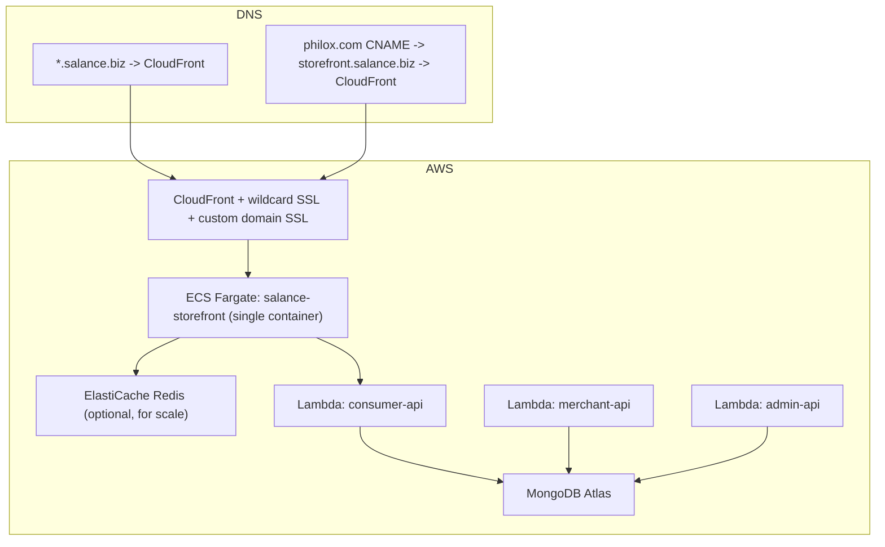
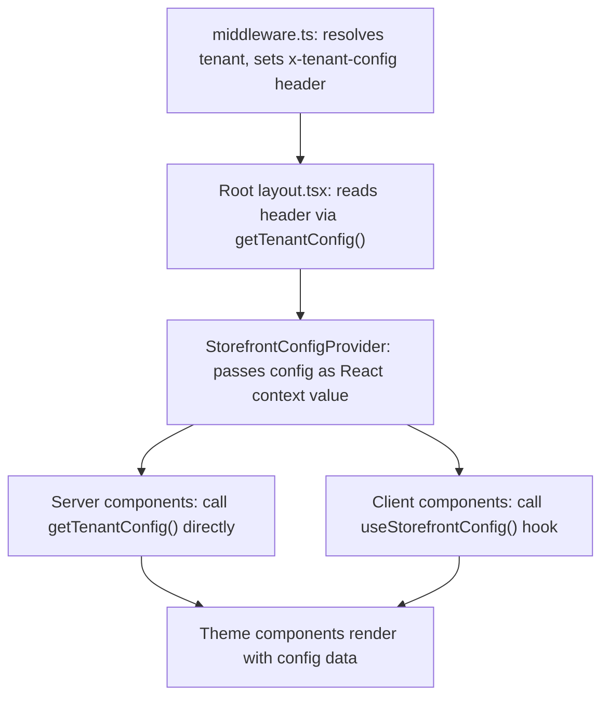
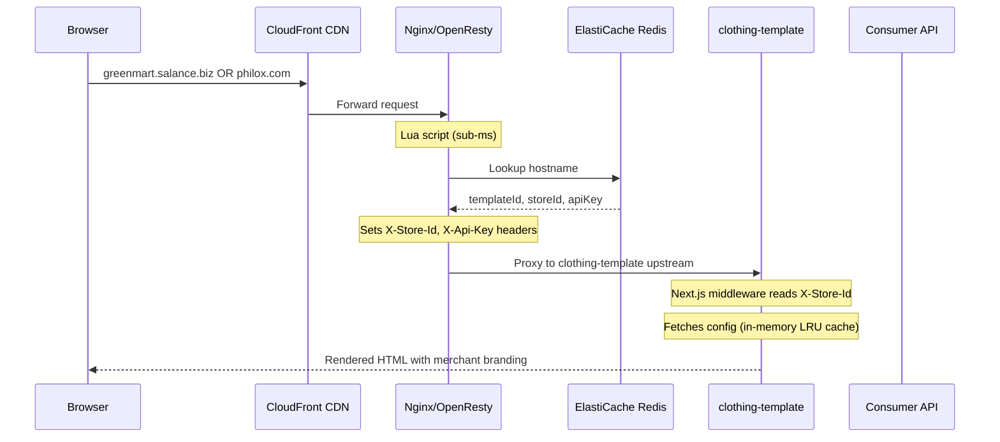
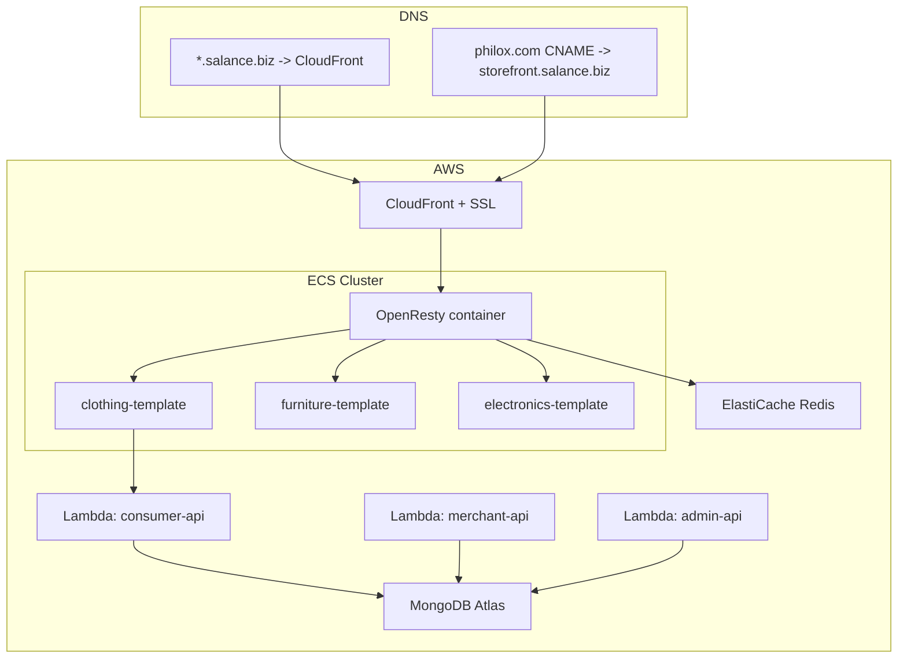

# Salance Architecture: Two Options Compared

Two architectures for transforming Salance from manual SaaS to self-service Product. Both share the same backend changes (StorefrontConfig model, APIs, provisioning). They differ only in how the storefront frontend is structured and deployed.

**Target infrastructure: AWS (no Vercel dependency)**

---
# OPTION A: Single Next.js App (Templates as Themes)

## The Concept

ALL templates live in ONE Next.js application. Templates become "themes" -- different sets of layouts, components, and styles. The middleware resolves both the tenant and the theme, then renders the correct one.

**Who does this**: Hashnode, Cal.com, Dub.co. The Shopify model (single engine, multiple themes).

---

## Infrastructure



**AWS cost estimate**: ~$120-150/month (1 ECS Fargate task + optional Redis)

---

## Project Structure

Follows your existing conventions: kebab-case files, `features/` pattern, `@/` imports, `I` prefix for interfaces, `core/` for business logic, `components/` for UI.

```
salance-storefront/
│
├── middleware.ts                         # [1] Tenant + theme resolution
│
├── src/
│   ├── app/
│   │   ├── layout.tsx                    # [2] Root layout -- injects theme CSS vars
│   │   └── (storefront)/                 # Route group for all store pages
│   │       ├── layout.tsx                # [3] Storefront shell (header, footer from theme)
│   │       ├── page.tsx                  # [4] Home page
│   │       ├── products/
│   │       │   ├── page.tsx              # Product listing
│   │       │   └── [id]/page.tsx         # Product detail
│   │       ├── collections/
│   │       │   └── [id]/page.tsx         # Category/collection page
│   │       ├── cart/page.tsx
│   │       ├── checkout/page.tsx
│   │       ├── about/page.tsx            # [5] About page
│   │       ├── contact/page.tsx
│   │       ├── policies/
│   │       │   ├── terms-and-conditions/page.tsx
│   │       │   ├── refund-policy/page.tsx
│   │       │   └── privacy-policy/page.tsx
│   │       ├── sitemap.xml/route.ts      # Dynamic per-merchant sitemap
│   │       └── robots.txt/route.ts       # Dynamic per-merchant robots
│   │
│   ├── themes/                           # [6] Each template = a theme folder
│   │   ├── clothing/
│   │   │   ├── components/
│   │   │   │   ├── hero-slider.tsx       # Clothing-specific hero
│   │   │   │   ├── product-card.tsx      # Clothing-style product card
│   │   │   │   ├── category-cards.tsx
│   │   │   │   ├── bottom-banner.tsx
│   │   │   │   └── promotional-banner.tsx
│   │   │   ├── layouts/
│   │   │   │   ├── header.tsx            # Clothing theme header
│   │   │   │   ├── footer.tsx            # Clothing theme footer
│   │   │   │   ├── home-layout.tsx       # Home page composition
│   │   │   │   ├── product-layout.tsx    # Product detail composition
│   │   │   │   └── about-layout.tsx      # About page composition
│   │   │   ├── theme.css                 # Theme-specific CSS overrides
│   │   │   └── index.ts                  # Theme registry entry (exports all)
│   │   │
│   │   ├── furniture/
│   │   │   ├── components/...            # Furniture-specific components
│   │   │   ├── layouts/...
│   │   │   ├── theme.css
│   │   │   └── index.ts
│   │   │
│   │   └── electronics/
│   │       ├── components/...
│   │       ├── layouts/...
│   │       ├── theme.css
│   │       └── index.ts
│   │
│   ├── features/                         # [7] Shared business logic (ALL themes use these)
│   │   ├── products/
│   │   │   ├── core/
│   │   │   │   ├── product-action.ts     # getProducts(), getProductById()
│   │   │   │   ├── product-utils.ts      # productSearchParams (nuqs)
│   │   │   │   ├── hooks/
│   │   │   │   │   └── use-products.ts   # React Query hook
│   │   │   │   └── types/
│   │   │   │       └── product-types.ts  # IProductResponseDTO, IVariant, etc.
│   │   │   └── components/               # Shared product UI (used by ALL themes)
│   │   │       ├── product-carousel.tsx
│   │   │       ├── image-gallery.tsx
│   │   │       ├── product-input-panel.tsx
│   │   │       └── product-variant-selector.tsx
│   │   │
│   │   ├── cart/
│   │   │   ├── core/
│   │   │   │   ├── cart-actions.ts       # getCart(), addToCart(), etc.
│   │   │   │   ├── cart-cookie-actions.ts
│   │   │   │   ├── hooks/
│   │   │   │   │   ├── use-cart.ts
│   │   │   │   │   ├── use-cart-update.ts
│   │   │   │   │   └── use-cart-remove.ts
│   │   │   │   └── types/
│   │   │   │       └── cart-types.ts     # ICartResponseDTO, ILineItem, etc.
│   │   │   └── components/
│   │   │       └── ...                   # Cart page, cart items, totals
│   │   │
│   │   ├── checkout/
│   │   │   ├── core/
│   │   │   │   ├── checkout-actions.ts   # createOrder(), getOrderById()
│   │   │   │   ├── checkout-utils.ts     # createOrderData(), orderSchema
│   │   │   │   ├── gateways/             # Payment gateway implementations
│   │   │   │   │   ├── base-gateway.ts
│   │   │   │   │   ├── factory.ts        # PaymentGatewayFactory
│   │   │   │   │   ├── cod-gateway.ts
│   │   │   │   │   ├── payhere-gateway.ts
│   │   │   │   │   ├── koko-gateway.ts
│   │   │   │   │   └── mintpay-gateway.ts
│   │   │   │   └── types/
│   │   │   │       └── checkout-types.ts
│   │   │   └── components/
│   │   │       └── ...                   # Order form, payment accordion, etc.
│   │   │
│   │   ├── categories/
│   │   │   ├── core/
│   │   │   │   ├── category-action.ts
│   │   │   │   ├── category-utils.ts     # buildCategoryTree()
│   │   │   │   ├── hooks/use-category.ts
│   │   │   │   └── types/category-types.ts
│   │   │   └── components/
│   │   │       └── ...                   # Category sidebar, filters
│   │   │
│   │   ├── payment-gateways/
│   │   │   └── core/
│   │   │       ├── payment-gateway-actions.ts
│   │   │       ├── payment-gateway-config.ts
│   │   │       ├── hooks/use-payment-gateways.ts
│   │   │       └── types/payment-gateway-types.ts
│   │   │
│   │   └── store/
│   │       └── core/
│   │           ├── store-action.ts       # getStore()
│   │           ├── hooks/use-store.ts
│   │           └── types/store-types.ts  # IStoreResponseDTO
│   │
│   ├── config/
│   │   ├── api.config.ts                 # [8] Dynamic fetcher (x-api-key from tenant)
│   │   ├── env.config.ts
│   │   └── site.config.ts               # REMOVED -- replaced by StorefrontConfig
│   │
│   ├── providers/
│   │   ├── react-query-provider.tsx
│   │   └── storefront-config-provider.tsx  # [9] Tenant config context
│   │
│   ├── lib/
│   │   ├── theme-registry.ts             # [10] Maps templateId -> theme module
│   │   ├── tenant-context.ts             # [11] Server-side tenant resolution
│   │   └── config-cache.ts              # [12] In-memory LRU cache for configs
│   │
│   ├── components/
│   │   ├── layouts/
│   │   │   ├── page-layout.tsx
│   │   │   └── section-layout.tsx
│   │   ├── shared/                       # Shared across ALL themes
│   │   │   ├── logo.tsx                  # Dynamic: renders config.branding.logoUrl
│   │   │   ├── breadcrumb.tsx
│   │   │   ├── pagination.tsx
│   │   │   ├── image-with-fallback.tsx
│   │   │   ├── scroll-top.tsx
│   │   │   └── skeletons/
│   │   └── ui/                           # shadcn/ui primitives
│   │
│   ├── constants/
│   │   └── common-constants.ts           # PATHS, QUERY_KEYS, etc. (static only)
│   │
│   ├── hooks/
│   │   ├── use-search.tsx
│   │   └── use-mobile.tsx
│   │
│   ├── types/
│   │   └── index.ts                      # IBaseEntity, ICommonResponseDTO, etc.
│   │
│   ├── utils/
│   │   ├── tailwind-utils.ts             # cn()
│   │   ├── common-utils.ts               # handleResponse, decimalCalculations
│   │   ├── price-utils.ts
│   │   ├── logger-utils.ts
│   │   └── react-query-utils.ts
│   │
│   └── styles/
│       └── global.css                    # CSS vars injected dynamically from theme
│
├── next.config.mjs
├── Dockerfile
├── tailwind.config.ts
└── package.json
```

---

## Detailed Explanations (Numbered References)

### [1] Middleware -- How Tenant Resolution Works

The `middleware.ts` sits at the project root (Next.js convention). It runs on every **page navigation** (not static assets -- CloudFront caches those). Here is the exact mechanism:

```typescript
// middleware.ts
import { NextRequest, NextResponse } from 'next/server';

const CONFIG_CACHE = new Map<
  string,
  { config: IStorefrontConfig; expiry: number }
>();
const CACHE_TTL = 5 * 60 * 1000; // 5 minutes

export async function middleware(request: NextRequest) {
  const hostname = request.headers.get('host') || '';

  // Step 1: Determine if this is a subdomain or custom domain
  const isSubdomain = hostname.endsWith('.salance.biz');
  const lookupKey = isSubdomain
    ? hostname.replace('.salance.biz', '') // "greenmart"
    : hostname; // "philox.com"

  // Step 2: Check in-memory cache first (sub-ms)
  const cached = CONFIG_CACHE.get(lookupKey);
  if (cached && cached.expiry > Date.now()) {
    return injectConfig(request, cached.config);
  }

  // Step 3: Cache miss -- call consumer API (only happens once per 5 min per tenant)
  const queryParam = isSubdomain
    ? `subdomain=${lookupKey}`
    : `domain=${lookupKey}`;
  const res = await fetch(
    `${process.env.CONSUMER_API_URL}/v1/storefront-config/resolve?${queryParam}`
  );

  if (!res.ok) {
    return NextResponse.rewrite(new URL('/not-found', request.url));
  }

  const config: IStorefrontConfig = await res.json();

  // Step 4: Cache the result
  CONFIG_CACHE.set(lookupKey, { config, expiry: Date.now() + CACHE_TTL });

  return injectConfig(request, config);
}

function injectConfig(request: NextRequest, config: IStorefrontConfig) {
  // Step 5: Pass tenant data downstream via request headers
  // Server components read these; client components get them via StorefrontConfigProvider
  const response = NextResponse.next();
  response.headers.set('x-tenant-config', JSON.stringify(config));
  response.headers.set('x-api-key', config.apiKeyPublic);
  response.headers.set('x-template-id', config.templateId);
  return response;
}

// Only run middleware on page routes, not static files
export const config = {
  matcher: ['/((?!_next/static|_next/image|favicon.ico).*)'],
};
```

**Why the consumer API and not Redis directly?**
The middleware runs inside the Next.js process. It cannot directly connect to Redis (Redis requires a persistent TCP connection, middleware is stateless). Instead, it calls the consumer API which has Redis/Momento caching internally. The middleware's own `Map` cache ensures it only calls the API once every 5 minutes per tenant.

**Performance on every request:**

- Warm cache hit (99% of requests): ~0.01ms (JavaScript `Map.get()`)
- Cold cache miss (first request per tenant or every 5 min): ~10-20ms (API call)
- Static assets (JS, CSS, images): Skipped entirely by the `matcher` config

---

### [2] Tailwind + Dynamic Theme Colors

Tailwind is configured to use CSS variables for theme colors. Components use standard Tailwind classes (`bg-primary`, `text-primary`, `rounded-lg`); the actual values come from StorefrontConfig at runtime.

**Step 1: tailwind.config.ts** — Map theme tokens to CSS variables. Tailwind generates classes that reference these variables.

```typescript
// tailwind.config.ts
import type { Config } from 'tailwindcss';

const config: Config = {
  content: ['./src/**/*.{js,ts,jsx,tsx,mdx}'],
  theme: {
    extend: {
      colors: {
        primary: 'var(--primary)',
        secondary: 'var(--secondary)',
        accent: 'var(--accent)',
      },
      borderRadius: {
        DEFAULT: 'var(--radius)',
        lg: 'var(--radius)',
        md: 'calc(var(--radius) - 2px)',
        sm: 'calc(var(--radius) - 4px)',
      },
      fontFamily: {
        sans: ['var(--font-family)', 'system-ui', 'sans-serif'],
      },
    },
  },
  plugins: [],
};
export default config;
```

**Step 2: Root layout** — Inject CSS variable values from StorefrontConfig. These cascade to all components.

```typescript
// src/app/layout.tsx
import { getTenantConfig } from '@/lib/tenant-context';

export async function generateMetadata() {
  const config = await getTenantConfig();
  return {
    title: config.seo.title,
    description: config.seo.description,
    openGraph: { title: config.seo.title, url: config.canonicalDomain },
    icons: config.branding.faviconUrl ? { icon: config.branding.faviconUrl } : undefined,
  };
}

const radiusMap = {
  none: '0px',
  sm: '0.125rem',
  md: '0.375rem',
  lg: '0.5rem',
  full: '9999px',
} as const;

export default async function RootLayout({ children }) {
  const config = await getTenantConfig();

  const themeStyle = {
    '--primary': config.theme.primaryColor,
    '--secondary': config.theme.secondaryColor,
    '--accent': config.theme.accentColor,
    '--radius': radiusMap[config.theme.borderRadius],
    '--font-family': config.theme.fontFamily,
  } as React.CSSProperties;

  return (
    <html lang="en" style={themeStyle}>
      <body className="font-sans">
        <ReactQueryProvider>
          <StorefrontConfigProvider config={config}>
            {children}
          </StorefrontConfigProvider>
        </ReactQueryProvider>
      </body>
    </html>
  );
}
```

**Step 3: Components** — Use Tailwind classes. Values resolve at runtime from the injected variables.

```tsx
// Example: theme component
<button className="bg-primary text-white hover:bg-primary/90 rounded-lg px-4 py-2">
  Add to Cart
</button>
<div className="border-accent text-secondary">...</div>
```

**Flow**: Layout injects `--primary: #3b82f6` → Tailwind's `bg-primary` uses `var(--primary)` → button renders with merchant's color. No component changes when theme changes.

---

### [3] Storefront Shell Layout -- Theme-Specific Header/Footer

```typescript
// src/app/(storefront)/layout.tsx
import { getTenantConfig } from '@/lib/tenant-context';
import { loadTheme } from '@/lib/theme-registry';

export default async function StorefrontLayout({ children }) {
  const config = await getTenantConfig();
  const theme = await loadTheme(config.templateId);

  return (
    <>
      <theme.Header config={config} />
      <main>{children}</main>
      <theme.Footer config={config} />
      <ScrollTop />
    </>
  );
}
```

The header and footer come from the **theme**, not from shared components. The clothing theme has a different header than the furniture theme. But both receive the same `config` object for branding (logo, store name, social links, contact info).

---

### [4] Home Page -- How Themes Compose Pages

```typescript
// src/app/(storefront)/page.tsx
import { getTenantConfig } from '@/lib/tenant-context';
import { loadTheme } from '@/lib/theme-registry';
import PageLayout from '@/components/layouts/page-layout';

export default async function HomePage() {
  const config = await getTenantConfig();
  const theme = await loadTheme(config.templateId);

  // Each theme has its own home-layout that composes components differently
  return (
    <PageLayout>
      <theme.HomeLayout config={config} />
    </PageLayout>
  );
}
```

The **clothing theme's** `HomeLayout` might render: `HeroSlider -> NewArrivals -> CategoryCards -> BestSellers -> BottomBanner` (exactly like current philox-clothing).

The **furniture theme's** `HomeLayout` might render: `FullWidthBanner -> FeaturedCategories -> TrendingProducts -> TestimonialSection`.

The page file (`page.tsx`) is the same for all themes. The theme decides what components appear and in what order.

---

### [5] About Page -- Tenant-Specific Content from Theme + Config

```typescript
// src/app/(storefront)/about/page.tsx
import { getTenantConfig } from '@/lib/tenant-context';
import { loadTheme } from '@/lib/theme-registry';
import PageLayout from '@/components/layouts/page-layout';

export default async function AboutPage() {
  const config = await getTenantConfig();
  const theme = await loadTheme(config.templateId);

  // The theme provides the visual layout.
  // The config provides the content (aboutText, storeName, etc.)
  return (
    <PageLayout className='container'>
      <theme.AboutLayout config={config} />
    </PageLayout>
  );
}
```

Inside a theme's `AboutLayout`:

```typescript
// src/themes/clothing/layouts/about-layout.tsx
export function AboutLayout({ config }: { config: IStorefrontConfig }) {
  return (
    <div>
      <h1>{config.branding.storeName}</h1>
      {config.branding.tagline && <p>{config.branding.tagline}</p>}
      <div
        dangerouslySetInnerHTML={{ __html: config.content.aboutText || '' }}
      />
      <ContactSection contact={config.contact} social={config.social} />
    </div>
  );
}
```

The about page content is NOT hardcoded in the theme. It comes from `config.content.aboutText` which the merchant fills in during onboarding or edits later from the dashboard.

---

### [6] Themes -- What a Theme Module Exports

Each theme folder is a self-contained module. Its `index.ts` exports everything the app needs:

```typescript
// src/themes/clothing/index.ts
export { default as Header } from './layouts/header';
export { default as Footer } from './layouts/footer';
export { default as HomeLayout } from './layouts/home-layout';
export { default as AboutLayout } from './layouts/about-layout';
export { default as ProductLayout } from './layouts/product-layout';
export { default as ProductCard } from './components/product-card';
export { default as CategoryCard } from './components/category-cards';
```

Themes contain ONLY visual components. They do NOT contain business logic (no API calls, no cart logic, no checkout). They import from `features/` for data.

---

### [7] Features Folder -- What It Is and Why

The `features/` folder contains **business logic shared across ALL themes**. This is the code you do NOT want to duplicate.

**Why it exists**: Every theme needs products, cart, checkout, categories, and payment gateways. The data fetching, mutations, hooks, types, and gateway implementations are identical regardless of whether the store uses the clothing theme or the furniture theme. Only the visual components change.

**What goes in features vs themes:**

| Goes in `features/` (shared)                        | Goes in `themes/` (per-template)     |
| --------------------------------------------------- | ------------------------------------ |
| `getProducts()`, `getProductById()`                 | `ProductCard` (how a product looks)  |
| `addToCart()`, `useCart()`                          | `Header` (navigation layout)         |
| `createOrder()`, `PaymentGatewayFactory`            | `HeroSlider` vs `FullWidthBanner`    |
| `IProductResponseDTO`, `ICartResponseDTO`           | `Footer` (layout, styling)           |
| `buildCategoryTree()`                               | `HomeLayout` (component composition) |
| `ProductInputPanel` (variant selector, add-to-cart) | `CategoryCards` (visual design)      |

Some components in `features/` are shared too (like `ProductInputPanel` which handles variant selection and add-to-cart). These have complex logic that is the same for all themes. A theme's `ProductLayout` wraps the shared `ProductInputPanel` in its own visual design.

---

### [8] API Client -- Dynamic x-api-key

Currently `api.config.ts` reads the API key from an env var. In the multi-tenant version, it reads from the tenant context:

```typescript
// src/config/api.config.ts
import { getApiKey } from '@/lib/tenant-context';

export async function fetcher(
  suffix: string,
  options?: RequestInit,
  params?: Record<string, string>
) {
  const apiKey = await getApiKey(); // reads from middleware-set header

  const url = new URL(`${environment.apiURL}${suffix}`);
  if (params) {
    Object.entries(params).forEach(([key, value]) =>
      url.searchParams.set(key, value)
    );
  }

  return fetch(url.toString(), {
    ...options,
    headers: {
      'Content-Type': 'application/json',
      'x-api-key': apiKey, // was: environment.apiKeyPublic
      ...options?.headers,
    },
  });
}
```

The `getApiKey()` function reads the `x-api-key` header that the middleware set. In server components this works via `headers()`. In client components the key is available via the `StorefrontConfigProvider` context.

---

### [9] StorefrontConfigProvider -- How Theme Config Reaches Client Components

Server components can read the config directly from headers (via `getTenantConfig()`). But client components need a React context. This is the provider:

```typescript
// src/providers/storefront-config-provider.tsx
'use client';

import { createContext, useContext } from 'react';

interface IStorefrontConfig {
  // ... same type as the DB model
}

const StorefrontConfigContext = createContext<IStorefrontConfig | null>(null);

export function StorefrontConfigProvider({
  config,
  children,
}: {
  config: IStorefrontConfig;
  children: React.ReactNode;
}) {
  return (
    <StorefrontConfigContext.Provider value={config}>
      {children}
    </StorefrontConfigContext.Provider>
  );
}

export function useStorefrontConfig() {
  const config = useContext(StorefrontConfigContext);
  if (!config)
    throw new Error(
      'useStorefrontConfig must be used within StorefrontConfigProvider'
    );
  return config;
}
```

**How data flows:**



---

### [10] Theme Registry -- How the Correct Theme Loads

```typescript
// src/lib/theme-registry.ts
const themes = {
  clothing: () => import('@/themes/clothing'),
  furniture: () => import('@/themes/furniture'),
  electronics: () => import('@/themes/electronics'),
  gems: () => import('@/themes/gems'),
  shoes: () => import('@/themes/shoes'),
  courses: () => import('@/themes/courses'),
} as const;

export type ThemeId = keyof typeof themes;

export async function loadTheme(templateId: string) {
  const loader = themes[templateId as ThemeId];
  if (!loader) throw new Error(`Unknown theme: ${templateId}`);
  return loader();
}
```

**Why dynamic imports?** Next.js code-splits dynamic imports. When a merchant uses the clothing theme, only the clothing theme's JavaScript is sent to the browser. The furniture, electronics, and other theme code is never downloaded. This keeps bundle sizes small regardless of how many themes exist.

---

### [11] Tenant Context -- Server-Side Config Access

```typescript
// src/lib/tenant-context.ts
import { headers } from 'next/headers';

export async function getTenantConfig(): Promise<IStorefrontConfig> {
  const headersList = await headers();
  const configHeader = headersList.get('x-tenant-config');
  if (!configHeader) throw new Error('Tenant config not found in headers');
  return JSON.parse(configHeader);
}

export async function getApiKey(): Promise<string> {
  const headersList = await headers();
  const apiKey = headersList.get('x-api-key');
  if (!apiKey) throw new Error('API key not found in headers');
  return apiKey;
}

export async function getCanonicalDomain(): Promise<string> {
  const config = await getTenantConfig();
  if (config.customDomain && config.customDomainVerified) {
    return `https://${config.customDomain}`;
  }
  return `https://${config.subdomain}.salance.biz`;
}
```

This is the bridge between middleware and server components. The middleware sets the headers; `getTenantConfig()` reads them. This uses Next.js's `headers()` API which is available in server components and route handlers.

---

### [12] Why ElastiCache Redis, Not MongoDB?

Your consumer API already hits MongoDB for products, orders, categories. The tenant config lookup happens on **every page request** (before any product data loads). Here's why Redis is better for this specific job:

**Speed**: MongoDB query for a simple doc lookup: ~5-15ms. Redis `GET` for the same data: ~0.5-1ms. On every page load, the user waits for this before seeing anything.

**Purpose**: Redis is an in-memory key-value store. Reading a config by subdomain is literally `GET subdomain:greenmart`. MongoDB is a document database designed for complex queries, aggregation, and relationships -- overkill for a key-value lookup.

**Load isolation**: If 100 merchants each get 1000 visitors/hour, that's 100K config lookups/hour on top of your existing MongoDB product/order queries. Redis handles this without impacting your product API performance.

**You already use caching**: Your APIs use Momento Cache (`momento-cache.config.ts`). Redis is the same concept but self-hosted on AWS. You could also use Momento for this if you prefer -- the principle is the same. The point is: don't hit MongoDB for this.

**However**: The middleware's in-memory `Map` cache means Redis is only hit once per tenant every 5 minutes. For your current scale (< 100 merchants), the MongoDB impact would be negligible. Redis becomes important when you scale to hundreds/thousands of merchants. You can start with MongoDB lookups and add Redis later.

---

## Should Option A Be a Monorepo?

**No.** Option A is a single Next.js app. There is no need for Turborepo, workspaces, or monorepo tooling. Everything lives in one `package.json`, one build, one deploy.

If you later want to share code between this storefront app and the merchant dashboard (e.g., shared types, shared UI components), you can extract those into an npm package or use a monorepo at that point. But for Option A alone, a single project is simpler and sufficient.

---

## Pros

- Simplest infrastructure: one container, one deployment, one CI/CD pipeline
- No routing layer needed: middleware handles everything
- Shared code is natural: features/ folder used by all themes
- One fix benefits all merchants instantly
- Lower AWS cost
- Single `package.json`, no monorepo complexity

## Cons

- All themes in one codebase: a broken deploy affects all merchants (mitigated by CI/CD and staging)
- Full redeploy on any theme change (~2 min deploy time)
- Needs code discipline to keep themes independent

---

---

# OPTION B: Separate Template Apps with Nginx

## The Concept

Each template is its own Next.js application. They share code via a Turborepo monorepo. **Nginx/OpenResty** sits in front, resolves domains from Redis, and proxies to the correct template app.

**Who does this**: WordPress Multisite (Nginx), Kong API Gateway (OpenResty), Shopify infrastructure (Sorting Hat).

---

## Request Flow



---

## Monorepo Structure

```
salance-storefronts/                      # TURBOREPO MONOREPO
│
├── apps/
│   ├── clothing-template/                # Refactored from philox-clothing
│   │   ├── middleware.ts                 # Reads X-Store-Id from Nginx
│   │   ├── src/
│   │   │   ├── app/
│   │   │   │   ├── layout.tsx            # Dynamic metadata from config
│   │   │   │   └── (storefront)/
│   │   │   │       ├── layout.tsx        # This template's header/footer
│   │   │   │       ├── page.tsx          # Home: HeroSlider, NewArrivals, etc.
│   │   │   │       ├── about/page.tsx    # About: reads config.content.aboutText
│   │   │   │       ├── products/
│   │   │   │       ├── collections/
│   │   │   │       ├── cart/page.tsx
│   │   │   │       ├── checkout/page.tsx
│   │   │   │       ├── contact/page.tsx
│   │   │   │       ├── sitemap.xml/route.ts
│   │   │   │       └── robots.txt/route.ts
│   │   │   ├── components/
│   │   │   │   ├── shared/              # This template's shared components
│   │   │   │   │   ├── header/
│   │   │   │   │   ├── footer.tsx
│   │   │   │   │   ├── logo.tsx         # Dynamic: config.branding.logoUrl
│   │   │   │   │   ├── hero-slider.tsx
│   │   │   │   │   └── bottom-banner.tsx
│   │   │   │   └── ui/                  # shadcn/ui (or imported from packages/ui)
│   │   │   ├── constants/
│   │   │   │   └── common-constants.ts  # PATHS, QUERY_KEYS (no hardcoded store data)
│   │   │   ├── providers/
│   │   │   │   ├── react-query-provider.tsx
│   │   │   │   └── config-provider.tsx  # Uses @salance/config
│   │   │   ├── styles/global.css
│   │   │   ├── hooks/
│   │   │   ├── types/
│   │   │   └── utils/
│   │   ├── Dockerfile
│   │   ├── next.config.mjs
│   │   └── package.json                 # Depends on @salance/* packages
│   │
│   ├── furniture-template/
│   │   ├── middleware.ts
│   │   ├── src/...                      # Different visual design, same structure
│   │   ├── Dockerfile
│   │   └── package.json
│   │
│   └── electronics-template/
│       ├── middleware.ts
│       ├── src/...
│       ├── Dockerfile
│       └── package.json
│
├── packages/
│   │
│   ├── core/                            # @salance/core
│   │   │  Shared business logic for ALL template apps.
│   │   │  Contains everything that is identical across templates:
│   │   │  API client, data fetching actions, React Query hooks, types.
│   │   │
│   │   ├── src/
│   │   │   ├── api-client.ts            # fetcher() with dynamic x-api-key
│   │   │   │
│   │   │   ├── products/
│   │   │   │   ├── product-action.ts    # getProducts(), getProductById()
│   │   │   │   ├── product-utils.ts     # productSearchParams (nuqs)
│   │   │   │   ├── hooks/
│   │   │   │   │   └── use-products.ts  # React Query hook
│   │   │   │   └── types/
│   │   │   │       └── product-types.ts # IProductResponseDTO, IVariant, etc.
│   │   │   │
│   │   │   ├── cart/
│   │   │   │   ├── cart-actions.ts      # getCart(), addToCart(), etc.
│   │   │   │   ├── cart-cookie-actions.ts
│   │   │   │   ├── hooks/
│   │   │   │   │   ├── use-cart.ts
│   │   │   │   │   ├── use-cart-update.ts
│   │   │   │   │   └── use-cart-remove.ts
│   │   │   │   └── types/
│   │   │   │       └── cart-types.ts    # ICartResponseDTO, ILineItem
│   │   │   │
│   │   │   ├── categories/
│   │   │   │   ├── category-action.ts
│   │   │   │   ├── category-utils.ts    # buildCategoryTree()
│   │   │   │   ├── hooks/use-category.ts
│   │   │   │   └── types/category-types.ts
│   │   │   │
│   │   │   ├── store/
│   │   │   │   ├── store-action.ts      # getStore()
│   │   │   │   ├── hooks/use-store.ts
│   │   │   │   └── types/store-types.ts
│   │   │   │
│   │   │   ├── types/
│   │   │   │   └── index.ts             # IBaseEntity, ICommonResponseDTO, etc.
│   │   │   │
│   │   │   └── utils/
│   │   │       ├── common-utils.ts      # handleResponse, decimalCalculations
│   │   │       ├── price-utils.ts       # formatPrice, formatPriceWithDiscount
│   │   │       └── logger-utils.ts
│   │   │
│   │   ├── package.json                 # name: "@salance/core"
│   │   └── tsconfig.json
│   │
│   ├── payments/                        # @salance/payments
│   │   │  Payment gateway implementations shared by ALL templates.
│   │   │  Contains the gateway factory, base class, and each provider.
│   │   │
│   │   ├── src/
│   │   │   ├── gateways/
│   │   │   │   ├── base-gateway.ts      # Abstract BasePaymentGateway
│   │   │   │   ├── factory.ts           # PaymentGatewayFactory.createGateway()
│   │   │   │   ├── cod-gateway.ts
│   │   │   │   ├── payhere-gateway.ts
│   │   │   │   ├── koko-gateway.ts
│   │   │   │   ├── mintpay-gateway.ts
│   │   │   │   └── server-utils.ts      # RSA signing, hash generation
│   │   │   ├── hooks/
│   │   │   │   └── use-payment-gateways.ts
│   │   │   ├── actions/
│   │   │   │   ├── payment-gateway-actions.ts
│   │   │   │   └── checkout-actions.ts  # createOrder(), getOrderById()
│   │   │   ├── types/
│   │   │   │   ├── payment-gateway-types.ts
│   │   │   │   └── checkout-types.ts
│   │   │   └── config/
│   │   │       └── payment-gateway-config.ts  # Payhere, Koko, MintPay URLs
│   │   │
│   │   ├── package.json                 # name: "@salance/payments"
│   │   └── tsconfig.json
│   │
│   ├── config/                          # @salance/config
│   │   │  Tenant resolution, StorefrontConfig type, config provider.
│   │   │  Shared middleware utilities used by each template's middleware.ts.
│   │   │
│   │   ├── src/
│   │   │   ├── types.ts                 # IStorefrontConfig interface
│   │   │   ├── tenant-context.ts        # getTenantConfig(), getApiKey()
│   │   │   ├── config-provider.tsx      # StorefrontConfigProvider + useStorefrontConfig()
│   │   │   ├── middleware-utils.ts      # resolveFromHeaders(), injectConfig()
│   │   │   └── config-cache.ts          # In-memory LRU cache for configs
│   │   │
│   │   ├── package.json                 # name: "@salance/config"
│   │   └── tsconfig.json
│   │
│   └── ui/                              # @salance/ui (optional)
│       │  Shared UI primitives if templates share shadcn/ui components.
│       │  Only needed if you want to avoid duplicating shadcn components
│       │  across template apps. Can be skipped initially.
│       │
│       ├── src/
│       │   ├── button.tsx
│       │   ├── sheet.tsx
│       │   ├── skeleton.tsx
│       │   └── ...
│       ├── package.json                 # name: "@salance/ui"
│       └── tsconfig.json
│
├── nginx/
│   ├── nginx.conf                       # OpenResty config with Lua routing
│   └── Dockerfile                       # FROM openresty/openresty:alpine
│
├── turbo.json                           # Turborepo pipeline config
├── package.json                         # Workspace root
└── .github/
    └── workflows/                       # CI/CD per app
```

---

## How Each Template App Uses Shared Packages

```typescript
// apps/clothing-template/package.json
{
  "dependencies": {
    "@salance/core": "workspace:*",
    "@salance/payments": "workspace:*",
    "@salance/config": "workspace:*"
  }
}
```

```typescript
// apps/clothing-template/src/app/(storefront)/products/page.tsx
import { getProducts } from '@salance/core/products/product-action';
import { ProductCard } from '@/components/shared/product-card'; // template-specific visual
```

```typescript
// apps/clothing-template/src/app/(storefront)/checkout/page.tsx
import { PaymentGatewayFactory } from '@salance/payments/gateways/factory';
import { useCart } from '@salance/core/cart/hooks/use-cart';
```

```typescript
// apps/clothing-template/middleware.ts
import {
  resolveFromHeaders,
  injectConfig,
  fetchConfig,
} from '@salance/config/middleware-utils';

export async function middleware(request: NextRequest) {
  const storeId = request.headers.get('x-store-id'); // Set by Nginx
  const apiKey = request.headers.get('x-api-key'); // Set by Nginx

  if (!storeId || !apiKey) {
    return NextResponse.rewrite(new URL('/not-found', request.url));
  }

  const config = await fetchConfig(storeId, apiKey); // Uses in-memory LRU cache
  return injectConfig(request, config);
}
```

**Key distinction**: In Option B, the middleware does NOT do domain resolution. Nginx already did that and passed `X-Store-Id` and `X-Api-Key` as headers. The middleware only fetches the full branding config and makes it available to the app.

---

## Nginx Routing (OpenResty + Lua)

```nginx
upstream clothing_template { server clothing-template:3000; }
upstream furniture_template { server furniture-template:3000; }
upstream electronics_template { server electronics-template:3000; }

server {
    listen 443 ssl;
    server_name *.salance.biz;
    ssl_certificate /etc/ssl/wildcard.salance.biz.pem;
    ssl_certificate_key /etc/ssl/wildcard.salance.biz.key;

    location / {
        set $target_upstream "";
        set $store_id "";
        set $api_key "";

        access_by_lua_block {
            local redis = require "resty.redis"
            local red = redis:new()
            red:connect("redis-host", 6379)

            local host = ngx.var.host
            local subdomain = host:match("^(.+)%.salance%.biz$")
            local key = subdomain and ("sub:" .. subdomain) or ("dom:" .. host)

            local template_id = red:hget(key, "templateId")
            local store_id = red:hget(key, "storeId")
            local api_key = red:hget(key, "apiKey")

            if not template_id then return ngx.exit(404) end

            ngx.var.target_upstream = template_id .. "_template"
            ngx.var.store_id = store_id
            ngx.var.api_key = api_key
        }

        proxy_set_header X-Store-Id $store_id;
        proxy_set_header X-Api-Key $api_key;
        proxy_set_header X-Forwarded-Host $host;
        proxy_pass http://$target_upstream;
    }
}
```

---

## Infrastructure



**AWS cost estimate**: ~$300-400/month (Nginx + 6 ECS tasks + Redis)

---

## Pros

- Full isolation: one template's bug cannot affect another
- Independent deployments: update furniture without touching clothing
- Each template can have its own dependencies or Next.js version
- Battle-tested routing: Nginx/OpenResty (used by Kong, Cloudflare, WordPress)
- Easy to add new templates: new app in monorepo + Nginx upstream

## Cons

- More infrastructure: Nginx + N containers vs 1
- Higher AWS cost (~2.5x Option A)
- OpenResty/Lua expertise needed for routing
- More complex CI/CD: build/deploy N apps
- Custom domain SSL more complex

---
# Common Foundation (Shared by Both Options)

### StorefrontConfig Model

New MongoDB collection. Holds everything currently hardcoded in template code.

```typescript
interface IStorefrontConfig {
  store: Types.ObjectId;
  subdomain: string; // unique index -- always present
  customDomain?: string; // unique sparse index -- premium only
  customDomainVerified: boolean;
  templateId: string; // "clothing" | "furniture" | "electronics" | etc.
  plan: 'STARTER' | 'PREMIUM';

  branding: {
    storeName: string;
    logoUrl?: string;
    faviconUrl?: string;
    tagline?: string;
  };
  theme: {
    primaryColor: string;
    secondaryColor: string;
    accentColor: string;
    fontFamily: string;
    borderRadius: 'none' | 'sm' | 'md' | 'lg' | 'full';
  };
  content: {
    heroTitle: string;
    heroSubtitle?: string;
    heroImageUrl?: string;
    aboutText?: string;
    footerText?: string;
  };
  social: {
    facebook?: string;
    instagram?: string;
    tiktok?: string;
    whatsapp?: string;
  };
  contact: { email: string; phone?: string; address?: string };
  seo: {
    title: string;
    description: string;
    keywords: string[];
    ogImageUrl?: string;
  };
  status: 'ACTIVE' | 'SUSPENDED' | 'MAINTENANCE';
}
```

### API Endpoints

**Consumer API**: `GET /v1/storefront-config/resolve?subdomain=xxx` and `?domain=philox.com`
**Merchant API**: CRUD for storefront config + custom domain management
**Admin API**: Provisioning endpoint + full CRUD

### Domain Strategy

- **Standard plan**: `{store}.salance.biz` via wildcard DNS
- **Premium plan**: `philox.com` via CNAME + DNS verification + CloudFront alternate domain + ACM cert

### SEO

Each merchant has a unique domain/subdomain -- Google treats them as separate sites. Next.js SSR returns fully-rendered HTML, not a loading spinner. Products are unique per store. Dynamic `generateMetadata()`, `sitemap.xml`, `robots.txt`, JSON-LD per merchant. Canonical URLs use the merchant's actual domain. This is how Shopify works at scale.

---

---

# Side-by-Side Comparison

### Adding a New Merchant

**Both**: Insert StorefrontConfig + Redis entry. Live in seconds. Zero deployments.

### Adding a New Template

**Option A**: New `themes/` folder, register in theme registry, redeploy.
**Option B**: New `apps/` folder, Dockerfile, Nginx upstream, deploy new container.

### Updating Shared Logic (cart, checkout, payments)

**Option A**: Update in `features/`, redeploy once.
**Option B**: Update in `packages/core` or `packages/payments`, `turbo build`, redeploy all template apps.

### Blast Radius of a Bug

**Option A**: Bad deploy affects all merchants (rollback fixes it).
**Option B**: Bad deploy only affects merchants on that specific template.

### AWS Cost

**Option A**: ~$120-150/month
**Option B**: ~$300-400/month

### Team Size

**Option A**: 1-2 developers
**Option B**: 2-3 developers

---


